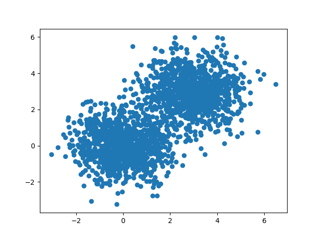
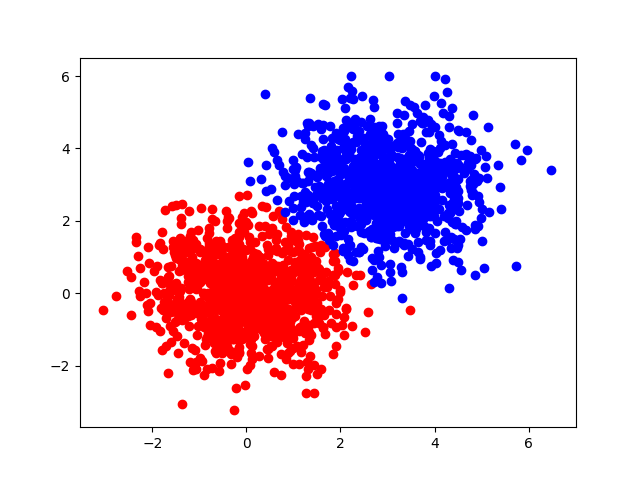
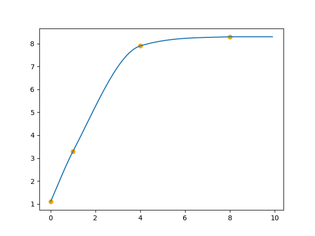
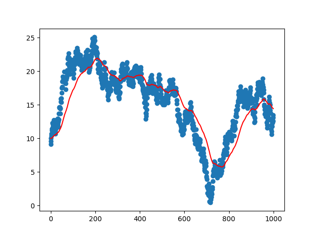

# mentat examples

## Nearest neighbours

### Balanced Box-Decomposition trees
<a name="bbdtrees"></a>

Genereate the data for two clusters:

```nim
import science/Distributions
import mentat/trees
import sequtils

let n = 1000
let px = concat(rnorm(n, 0.0, 1.0), rnorm(n, 3.0, 1.0))
let py = concat(rnorm(n, 0.0, 1.0), rnorm(n, 3.0, 1.0))
```


Find approximate nearest neighbours for each "centroid":

```nim
var points:seq[seq[float]] = @[]
for i in 0..<2*n:
    points.add @[px[i], py[i]]
    
let tree = newBBDTree(points)
let c1 = @[0.0, 0.0]
let c2 = @[3.0, 3.0]
discard tree.clustering(@[c1, c2])

echo tree.membership
```


## Splines
<a name="splines"></a>

### Monotonic Cubic Spline interpolation

```nim
import matplotnim
import mentat/splines

let x = @[0.0, 1.0, 4.0, 8.0]
let y = @[1.1, 3.3, 7.9, 8.3]

let spline = newSplineInterpolator(x, y)

var x2 = newSeq[float](100)
var y2 = newSeq[float](100)

for p in 0..<100:
    x2[p] = float(p) / 10.0
    y2[p] = spline.interpolate(x2[p])

let figure = newFigure()
let points = newScatterPlot(x, y)
points.colour = "orange"
figure.add points
let line = newLinePlot(x2, y2)
figure.add line
figure.save("examples/spline_interpolation.png")
```



## Time-series

### Exponentially weighted moving average (EWMA)
<a name="ewma"></a>

```nim
import matplotnim
import mentat/timeseries
import random
import sequtils

var data: seq[float] = newSeq[float](1000)

data[0] = 10.0

for i in 1..<1000:
    data[i] = data[i-1] + 1.0 - rand(2.0)


var avg: seq[float] = newSeq[float](1000)
avg[0] = data[0]
let ewma = newEWMA(data[0], 50)
for i in 1..<1000:
    avg[i] = ewma.update(data[i])

let figure = newFigure()
let x = toSeq(0..<1000)
let sp = newScatterPlot(x, data)
figure.add sp
let lp = newLinePlot(x, avg)
lp.colour = "red"
figure.add lp
figure.save("examples/ex_ewma.png")
```

